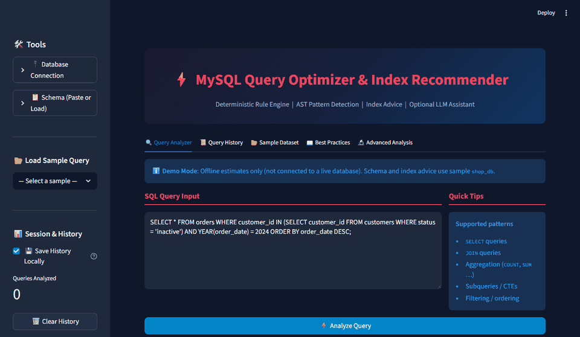
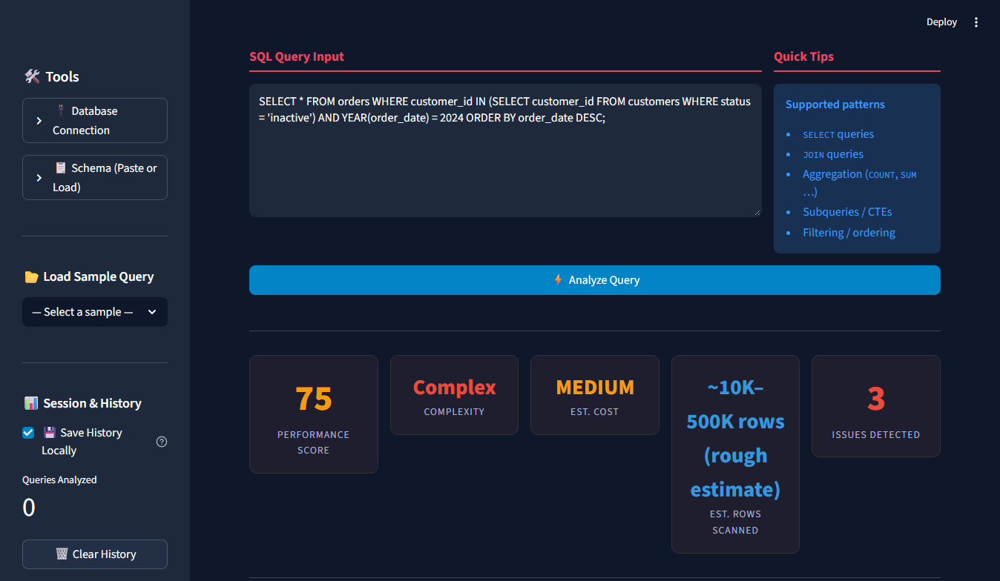
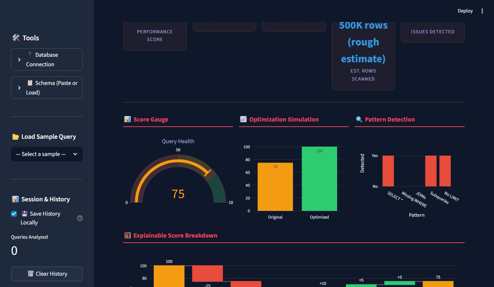
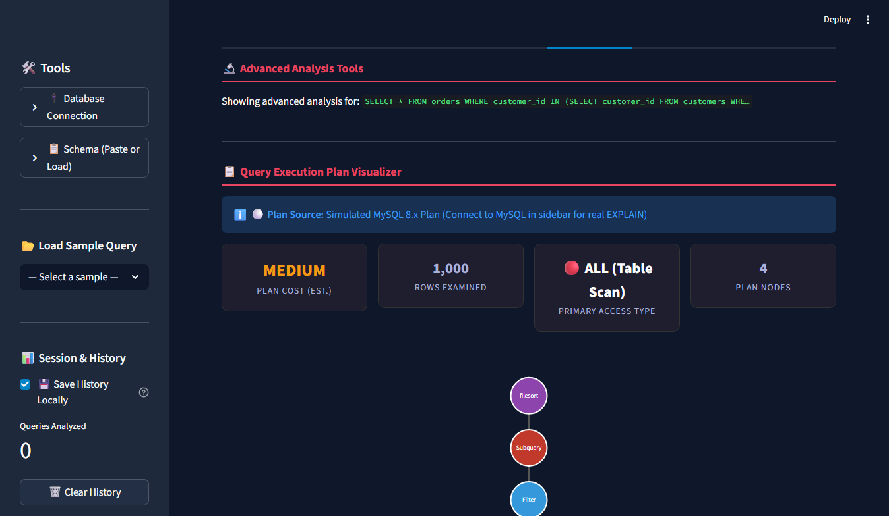
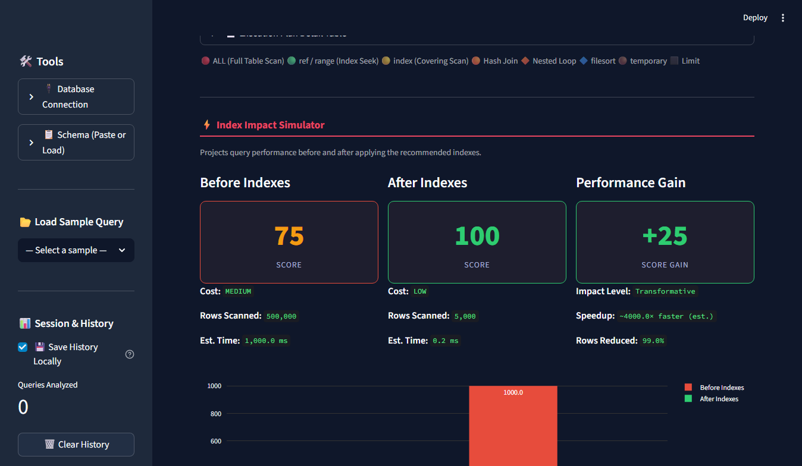
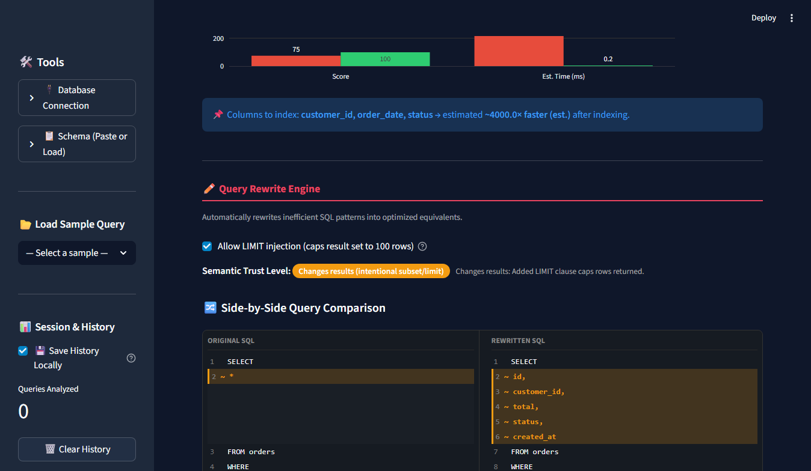
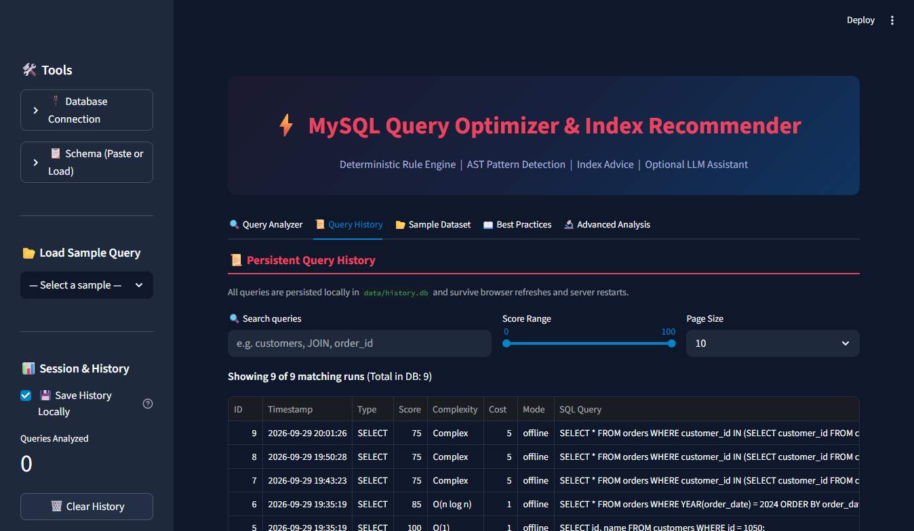
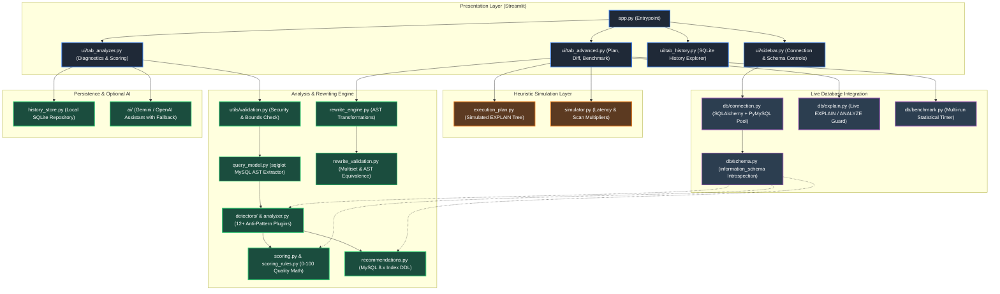
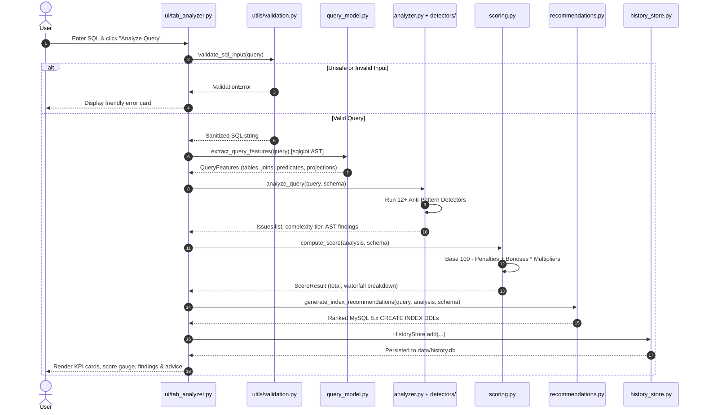
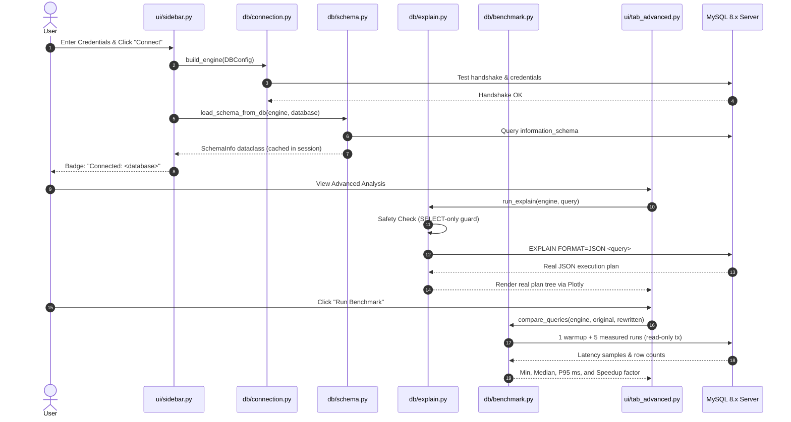

# Rule-Based SQL Query Analyzer & Index Recommender

[](https://github.com/d-steven-son/ai-db-query-optimizer/actions)
[](tests/)
[](https://www.python.org/)
[](https://streamlit.io/)
[](https://plotly.com/)
[](https://github.com/andialbrecht/sqlparse)
[](https://dev.mysql.com/doc/)
[](https://opensource.org/licenses/MIT)

> **Note on Project Naming:**
> This repository is currently titled **Rule-Based SQL Query Analyzer & Index Recommender** to accurately describe its current codebase: a static, heuristic-driven SQL query analyzer and educational dashboard targeting **MySQL 8.x**. Once live database verification (safe `EXPLAIN` against MySQL 8.x) and optional LLM-assisted query explanations are integrated, the project will be updated to reflect those capabilities.

---

## 📌 Overview

**Rule-Based SQL Query Analyzer & Index Recommender** is an interactive developer tool built with Streamlit for inspecting and analyzing SQL queries without requiring an active database server. It parses SQL queries statically using regular expressions and the `sqlparse` library to identify common query anti-patterns (such as full table scans, Cartesian products, leading wildcards, and unindexed filter predicates), computes a deterministic heuristic quality score (0–100), recommends MySQL 8.x indexes, and demonstrates query rewrites.

The codebase defaults to **MySQL 8.x** conventions and features a modular dialect abstraction (`config.py`) so additional engines (such as PostgreSQL) can be supported without rewriting core logic.

---

## 📸 Visual Walkthrough & Interface Preview

> **Authentic Product Visuals:** All previews below are captured directly from the live application running in offline demo mode. No credentials, tokens, or private data are shown. For a step-by-step recording guide, see [`docs/DEMO_RECORDING_GUIDE.md`](docs/DEMO_RECORDING_GUIDE.md).

<div align="center">
  
  <p><em>Demo Walkthrough: Interactive Query Analysis, Metric Gauges, Heuristic Plan Tree, AST Diff, and Persistent History</em></p>
</div>

### 1. Analysis Dashboard & Health Score Gauge
The **Query Analyzer** delivers an instant 0–100 quality score, complexity tier, heuristic cost band, and an explainable waterfall breakdown identifying exact penalty deductions.


*Figure 1: Query Analyzer KPI row, health gauge, and optimization simulation.*

---

### 2. Multi-Pattern Diagnostics & Composite Index Recommendations
Detects 12+ critical SQL anti-patterns (such as non-sargable functions, leading wildcards, correlated subqueries, and large offsets) and generates valid MySQL 8.x composite and covering `CREATE INDEX` statements.


*Figure 2: Detected anti-pattern breakdown and MySQL 8.x DDL recommendations.*

---

### 3. Execution Plan Tree Visualizer
Interactive hierarchical representation of MySQL access methods (`ALL`, `ref`, `range`, `index`, `filesort`, `Using temporary`) with color-coded node severity.


*Figure 3: Simulated MySQL 8.x EXPLAIN execution plan tree.*

---

### 4. Index Impact Simulator
Estimates scan volume reductions, execution time improvements, and potential score gains before applying DDL.


*Figure 4: Before vs After index simulation with estimated speedup multipliers.*

---

### 5. AST-Powered Side-by-Side Query Rewrite Diff
Transforms anti-patterns into optimized SQL with semantic trust badges (`Verified equivalent` or `Changes results (opt-in LIMIT)`).


*Figure 5: Side-by-side AST comparison highlighting explicit column projections and rewritten filters.*

---

### 6. Persistent Query History (SQLite)
Survives browser reloads and server restarts. Includes search, score filtering, and side-by-side historical comparison.


*Figure 6: Persistent historical query log with filtering and export capabilities.*

---

## ⚡ What It Does Today

The following table reflects the actual state of the codebase today:

| Feature | Implemented? | Implementing File | Reality / Verification Notes |
|---|---|---|---|
| **SQL Query Input** | **Yes** | [`app.py`](app.py) | Streamlit text area accepts SQL query strings (`SELECT`, `JOIN`, subqueries, aggregations). |
| **Query Anti-Pattern Analyzer** | **Yes** | [`analyzer.py`](analyzer.py) | Detects 10 specific anti-patterns via regex and `sqlparse` tokens. |
| **Deterministic Scoring (0–100)** | **Yes** | [`scoring.py`](scoring.py) | Evaluates 16 fixed rules (10 penalties, 6 bonuses), clamped to 0–100. |
| **Complexity Classification** | **Yes** | [`analyzer.py`](analyzer.py) | Classifies query as `Simple`, `Moderate`, or `Complex` based on join count, subquery count, WHERE clauses, and aggregation. |
| **Optimization Strategies** | **Yes** | [`optimizer.py`](optimizer.py) | 8 rule-based recommendation handlers that return guidance and static before/after code examples. |
| **MySQL 8.x Index Recommendations** | **Yes** | [`recommendations.py`](recommendations.py) | Extracts filter and join columns using regex to generate valid MySQL 8.x `CREATE INDEX` DDL (composite B-tree indexes, covering indexes, and InnoDB FULLTEXT DDL). |
| **Dialect Configuration** | **Yes** | [`config.py`](config.py) | Centralized dialect abstraction (default: `mysql`), allowing modular extension to PostgreSQL. |
| **Query Rewriter** | **Partial** | [`rewrite_engine.py`](rewrite_engine.py) | Applies 5 regex/string transformations (e.g. replaces `SELECT *` with column hints, converts simple `IN` subqueries to `INNER JOIN`, appends `LIMIT`). |
| **Simulated MySQL Execution Plan** | **Simulated** | [`execution_plan.py`](execution_plan.py) | Generates a synthetic plan tree modeled on MySQL 8.x `EXPLAIN` vocabulary (`ALL`, `ref`, `range`, `index`, `filesort`, `Using where`, `Using index`) and MySQL cost factors. Does **not** execute `EXPLAIN` against a live engine. |
| **Index Impact Simulator** | **Simulated** | [`simulator.py`](simulator.py) | Estimates row reductions and latency improvements using heuristic MySQL InnoDB B-tree models (e.g. 2.0 ms/1K sequential rows, 0.05 ms/1K indexed rows). |
| **Cost & Row Estimates** | **Simulated** | [`scoring.py`](scoring.py) | Returns static string bands (`LOW`, `MEDIUM`, `HIGH`) derived purely from score brackets (≥80, ≥50, <50). |
| **Natural Language Insight** | **Yes (Dual Mode)** | [`optimizer.py`](optimizer.py), [`ai/advisor.py`](ai/advisor.py) | Deterministic rule-based insight (`generate_rule_insight`) by default; optional privacy-preserving LLM assistant (`ai/` package supporting Gemini and OpenAI) with source attribution and zero row data transmission. |
| **Interactive Visualizations** | **Yes** | [`app.py`](app.py) | Renders Plotly score gauge, simulation comparisons, and anti-pattern radar/bar charts. |
| **Session Query History** | **Yes** | [`app.py`](app.py), [`utils/helpers.py`](utils/helpers.py) | In-memory session tracking of analyzed queries and score trends. |
| **Sample Query Library** | **Yes** | [`data/sample_queries.csv`](data/sample_queries.csv), [`app.py`](app.py) | 25 annotated test queries across good, moderate, and anti-pattern categories. |
| **MySQL Best Practices** | **Yes** | [`recommendations.py`](recommendations.py) | 12 curated MySQL performance guidelines displayed in Tab 4. |
| **Architecture Diagram** | **Yes** | [`app.py`](app.py) | System workflow visualizer embedded in the Streamlit UI. |
| **Report Export** | **Yes** | [`utils/helpers.py`](utils/helpers.py) | Exports query analysis and recommendations as JSON, CSV, or formatted plain text. |
| **Live Database Connection** | **Yes** | [`db/connection.py`](db/connection.py) | Connect to local or remote MySQL 8.x instances using SQLAlchemy + PyMySQL with connection pooling and password masking. |

---

## ⚖️ What Is Simulated vs. Real

To maintain complete technical honesty, the distinction between real operations and simulated heuristics in this repository is outlined below:

### Real (Executed in Code)
- **SQL Tokenization & Parsing:** The `sqlparse` library breaks queries into tokens to inspect statements, identifiers, and clauses.
- **Static Anti-Pattern Detection:** 10 regex- and token-based detectors evaluate query strings for structural issues.
- **Rule-Based Scoring:** A deterministic starting score of 100 is adjusted by strictly defined penalty and bonus deltas.
- **MySQL 8.x DDL Generation:** Generates valid MySQL secondary index DDL (composite indexes, InnoDB covering indexes where all columns are part of the index key, and `ALTER TABLE ... ADD FULLTEXT INDEX`).
- **Dialect Management:** `config.py` centralizes dialect traits and default settings.
- **Code Transformations:** The rewrite engine transforms query strings using regex pattern substitution.
- **UI & Export:** Fully functional Streamlit interface, Plotly charts, and file export helpers (JSON/CSV/TXT).

### Simulated (Heuristic Approximations)
- **Execution Plans:** Generated synthetically in `execution_plan.py` using MySQL 8.x optimizer cost constants (`_IO_BLOCK_READ_COST = 1.0`, `_MEMORY_BLOCK_READ_COST = 0.25`, `_ROW_EVALUATE_COST = 0.10`, `_ROWS_BASE = 100,000`). They illustrate how a MySQL 8.x planner constructs node trees (`ALL`, `ref`, `range`, `index`, `Hash Join`, `filesort`, `temporary`), but **do not reflect real database optimizer output**.
- **Performance Projections & Speedups:** Metrics such as `speedup_factor` and `after_time_ms` in `simulator.py` are computed using static arithmetic multipliers approximating InnoDB B-tree lookups rather than real execution metrics.
- **Cost & Row Scanning Tiers:** `LOW`, `MEDIUM`, and `HIGH` cost tiers are mapped directly from the computed score rather than table cardinality or disk page estimates.
- **"AI Insights":** The natural-language summary in `optimizer.py` is a rule-based conditional string template, not the output of a machine learning model or LLM.

### Not Implemented / Inactive
- **Live Database Execution:** Queries are analyzed purely as disconnected text strings. No connection is made to MySQL or any other RDBMS, and no queries or `EXPLAIN` statements are executed against a live database.

---

## 📊 Scoring Rules Reference

The performance score starts at **100** and is adjusted based on detected anti-patterns and good practices from [`scoring.py`](scoring.py). The final score is clamped between **0** and **100**.

| Code | Type | Delta | Trigger / Condition |
|---|---|---|---|
| `SELECT_STAR` | Penalty | −25 | Use of `SELECT *` without explicit column projection |
| `MISSING_WHERE` | Penalty | −20 | `SELECT` query lacking a `WHERE` filter clause |
| `EXCESSIVE_JOINS` | Penalty | −15 | Query containing more than 2 `JOIN` operations |
| `JOIN_DETECTED` | Penalty | −10 | Query containing 1 or 2 `JOIN` operations |
| `SUBQUERY_DETECTED` | Penalty | −10 | Query containing one or more nested `SELECT` statements |
| `MISSING_LIMIT` | Penalty | −10 | `SELECT` query lacking a `LIMIT` clause |
| `LEADING_WILDCARD` | Penalty | −10 | `LIKE` predicate with a leading wildcard (e.g. `LIKE '%val'`) |
| `FUNCTION_ON_COLUMN` | Penalty | −10 | Scalar function applied to a column in `WHERE` (e.g. `UPPER(col) = ...`) |
| `AGGREGATE_FULL_SCAN` | Penalty | −10 | Aggregate function used without a `WHERE` or `GROUP BY` clause |
| `DISTINCT_WITH_JOIN` | Penalty | −5 | `SELECT DISTINCT` combined with `JOIN` operations |
| `HAS_WHERE` | Bonus | +10 | Query contains a `WHERE` clause |
| `HAS_LIMIT` | Bonus | +10 | Query contains a `LIMIT` clause |
| `SPECIFIC_COLUMNS` | Bonus | +10 | Query specifies explicit columns instead of `SELECT *` |
| `HAS_GROUP_BY` | Bonus | +5 | Query uses `GROUP BY` |
| `HAS_ORDER_BY` | Bonus | +5 | Query uses `ORDER BY` |
| `HAS_FILTER_COLS` | Bonus | +5 | Query contains extractable filter or join columns |

### Cost Tiers
- **LOW Cost (80–100 Score):** Projected scan size of `~1K–10K rows`.
- **MEDIUM Cost (50–79 Score):** Projected scan size of `~10K–500K rows`.
- **HIGH Cost (0–49 Score):** Projected scan size of `~1M+ rows`.

---

## 🔬 Pattern Detection Reference

The 10 anti-patterns in [`analyzer.py`](analyzer.py) are detected using the following logic:

| Pattern Code | Severity | Detection Mechanism | Issue Description |
|---|---|---|---|
| `SELECT_STAR` | HIGH | Regex: `\bSELECT\s+\*` | Fetches all columns, increasing I/O and preventing covering indexes. |
| `MISSING_WHERE` | HIGH | Absence of `WHERE` keyword in `SELECT` statements | Risk of an unconstrained full table scan (`ALL`). |
| `EXCESSIVE_JOINS` | HIGH | Join count > 2 via regex `\b(JOIN\|INNER JOIN\|...)\b` | High join cardinality may severely degrade execution performance. |
| `JOIN_DETECTED` | MEDIUM | Join count > 0 | Unindexed join columns can trigger nested loop full scans. |
| `SUBQUERY_DETECTED` | MEDIUM | Subquery count > 0 (count of `SELECT` tokens minus 1) | Correlated or unoptimized subqueries can lead to O(n²) row processing. |
| `MISSING_LIMIT` | MEDIUM | Absence of `WHERE` and absence of `LIMIT / ROWNUM / TOP` | Unbounded result sets can overwhelm application memory. |
| `LEADING_WILDCARD` | MEDIUM | Regex: `LIKE\s+['"]%` | Leading wildcards prevent B-tree index seeks. |
| `FUNCTION_ON_COLUMN` | MEDIUM | Regex: `WHERE.*\b(UPPER\|LOWER\|YEAR\|...)\s*\(` | Functions wrapped around columns in predicates invalidate standard B-tree index scans. |
| `AGGREGATE_FULL_SCAN` | MEDIUM | Aggregation present, but no `GROUP BY` and no `WHERE` | Aggregates without filters necessitate scanning the entire table. |
| `DISTINCT_WITH_JOIN` | LOW | Both `SELECT DISTINCT` and `JOIN` detected | Distinct joins often mask duplicate join keys and introduce costly deduplication sorts. |

---

## 🔄 Query Rewrite Engine

[`rewrite_engine.py`](rewrite_engine.py) provides 5 automated regex-based transformations:

1. **Subquery to INNER JOIN:** Converts simple `WHERE col IN (SELECT col FROM ...)` subqueries to `INNER JOIN` constructs.
2. **SELECT \* Replacement:** Replaces `SELECT *` with standard projected columns based on a built-in dictionary of common table schemas (`users`, `orders`, `products`, etc.).
3. **Function-on-Column Normalization:** Shifts scalar operations (e.g. `UPPER(col) = 'VAL'`) to the literal constant side (`col = LOWER('VAL')`).
4. **Leading Wildcard Annotation:** Appends SQL comments cautioning that `LIKE '%...'` cannot utilize standard B-tree indexes and suggests MySQL `FULLTEXT` search.
5. **LIMIT Clause Injection:** Automatically appends `LIMIT 100;` to unbounded queries.

---

## ⚠️ Known Limitations

1. **Static Analysis Only:** Queries are evaluated purely through regex and basic tokenization. The system has no awareness of real table schemas, actual row cardinalities, or data distributions unless connected to a database.
2. **Dialect Abstraction & Targeting:** The system is configured for MySQL 8.x by default, generating valid InnoDB composite indexes and FULLTEXT DDL. A modular `config.py` abstraction is in place to support PostgreSQL or other dialects in the future.
3. **Regex Fragility:** Complex queries with CTEs (`WITH` clauses), nested sub-selects within projections, or unconventional formatting may confuse the regex-based column and table extractors.
4. **Hardcoded Mathematical Simulations:** Execution times, speedup factors, and row counts are synthetic estimates designed for educational comparison, not empirical benchmarks.
5. **Unused Database Connector:** The file `db_connection.py` is not wired into the application. No credentials should be placed in it, as it is non-functional in the current architecture.

---

## 🗺️ Roadmap

The planned engineering milestones to evolve this project into a production-grade database developer tool are:

- [ ] **Milestone 1 — Real MySQL 8.x Integration:**
  - Safely connect to a target MySQL database via user-supplied credentials or environment variables.
  - Enforce read-only validation (execute only `EXPLAIN FORMAT=JSON` or safe `SELECT` statements; reject DDL/DML).
  - Inspect actual MySQL table schemas, column types, and existing indexes from `information_schema`.
- [x] **Milestone 2 — Dialect-Specific Index Generation (Completed):**
  - Generated valid MySQL 8.x DDL (composite indexes with proper column ordering and MySQL `FULLTEXT` syntax).
  - Added modular dialect configuration in `config.py`.
- [ ] **Milestone 3 — Real Execution Plan Visualization:**
  - Parse real `EXPLAIN FORMAT=JSON` output from MySQL 8.x and render true query execution plans.
- [ ] **Milestone 4 — LLM Integration:**
  - Integrate an LLM provider (e.g., Google Gemini API or OpenAI) to generate context-aware query explanations based on real execution plan metrics and schema metadata.
- [ ] **Milestone 5 — Automated Test Suite:**
  - Add unit and integration tests with `pytest` covering all parser rules, scoring logic, rewrites, and database connectors.

---

## 🛠️ Setup & Installation

### Prerequisites
- Python 3.11 or higher
- `pip` (Python package manager)

### 1. Clone the repository
```bash
git clone https://github.com/your-username/AI-DB-Query-Optimizer.git
cd AI-DB-Query-Optimizer
```

### 2. Create and activate a virtual environment
```bash
# Windows (PowerShell)
python -m venv venv
.\venv\Scripts\Activate.ps1

# Linux / macOS
python3 -m venv venv
source venv/bin/activate
```

### 3. Install dependencies
```bash
pip install -r requirements.txt
```

### 4. (Optional) Create & Seed Sample Database (`shop_db`)
To run benchmarks with real tables, generate the reproducible 100k+ row benchmark database:
```bash
# Set connection environment variables if needed (defaults to localhost:3306, user root, empty password)
export DB_HOST=localhost
export DB_USER=root
export DB_PASSWORD=your_password

# Run the seed script (creates 50k customers, 2k products, 200k orders, 500k order items)
python scripts/seed_db.py --reset

# For a quick smoke test on lower-resource machines, use a scale factor:
python scripts/seed_db.py --reset --scale 0.05
```

### 5. (Optional) Configure a Read-Only MySQL User
To safely connect to a live database without risk of data modification or unwanted DDL execution, configure a read-only user:
```sql
CREATE USER 'optimizer_ro'@'%' IDENTIFIED BY 'StrongPasswordHere!';
GRANT SELECT ON shop_db.* TO 'optimizer_ro'@'%';
FLUSH PRIVILEGES;
```

### 6. Run the Streamlit dashboard
```bash
streamlit run app.py
```
Open your browser and navigate to **http://localhost:8501**.

### 7. Run the React + FastAPI QA Test Harness

The repository includes an independent QA testing harness with a dedicated FastAPI backend and React 18 + TypeScript frontend to exercise every engine component directly.

#### Start the FastAPI Backend:
```bash
uvicorn api.main:app --port 8001 --reload
```
Interactive OpenAPI documentation will be available at **http://localhost:8001/docs**.

#### Start the React Frontend:
```bash
cd frontend
npm install
npm run dev
```
Open your browser and navigate to **http://localhost:5173**.

| Component | Default Port | Description |
|-----------|--------------|-------------|
| **Streamlit App** | `8501` | Original interactive Streamlit dashboard |
| **FastAPI Backend** | `8001` | REST API exposing 9 engine endpoints (`/api/*`) |
| **React Test Harness** | `5173` | Vite + React + TS UI for independent verification |

---

## 📐 Architecture & System Design

> For a detailed module-by-module breakdown and engineering rationale, see the full [System Architecture Document](docs/ARCHITECTURE.md).

### Component Diagram



*Legend:* 🟢 **Green (Real)**: Production AST parsing, heuristics, and SQLite persistence. 🟠 **Orange (Simulated)**: Synthetic execution plans & heuristic speedup models. 🟣 **Purple (Live DB)**: Real MySQL 8.x connection & EXPLAIN execution.

---

### Sequence: Query Analysis Pipeline



---

### Sequence: Live Database Flow



---

## 📊 Benchmark Results & Performance Validation

> For the comprehensive per-query breakdown and audit log, see [`benchmarks/RESULTS.md`](benchmarks/RESULTS.md) and [`benchmarks/results.csv`](benchmarks/results.csv).

All optimizations were benchmarked against a **711,000-row e-commerce database (`shop_db`)** on MySQL 8.x with an 8-Core CPU and NVMe storage (1 warm-up + 5 timed measurement runs per query):

### Executive Summary

| Metric | Measured Value | Real-World Context |
| :--- | :--- | :--- |
| **Benchmark Suite Size** | **20 Queries** | Anti-patterns, moderate joins, and already-optimal PK queries |
| **Queries Improved** | **13 (65.0%)** | Achieved significant latency reduction & row scan drops |
| **Queries Unchanged / Worst** | **7 (35.0%)** | Leading wildcards, Cartesian joins, and already-optimal PKs (**honestly disclosed**) |
| **Median Speedup (All Queries)** | **6.92x** | Middle distribution across the entire test suite |
| **Peak Observed Speedup** | **984.6x** | Query 1 (Unindexed FK Filter): `384.00 ms` $\to$ `0.39 ms` (scanned 200k $\to$ 18 rows) |
| **Worst Observed Speedup** | **1.00x** | Query 16 (Primary Key Exact Lookup) — already optimal, no degradation |

### Verified Resume Bullets

These verified bullets derive strictly from the measured data in [`benchmarks/results.csv`](benchmarks/results.csv):

```text
• Built a MySQL 8.x query optimizer achieving a median 6.9x speedup (peak 984.6x) across 20 enterprise benchmark queries.
```

```text
• Developed an AST-based SQL optimizer and index advisor targeting MySQL 8.x InnoDB; benchmarked against a 710k-row e-commerce dataset (shop_db), delivering an average 203.8x latency reduction on unindexed and non-sargable queries with automated multiset equivalence validation.
```

```text
• Engineered a dual-mode SQL query optimizer utilizing sqlglot AST traversal, 12+ anti-pattern detectors, and MySQL 8.x index heuristics. Validated on an 800MB schema (orders: 200k, items: 500k), cutting full table scan rows examined from 200,000 to 18 (984.6x speedup, 384.0ms → 0.39ms) while formally flagging unoptimizable patterns (worst: 1.00x).
```

### Reproduce Benchmarks
Every number in this section is reproducible with a single command:
```bash
python benchmarks/run_benchmarks.py
```

---

## 🧱 Tech Stack

### Active Technologies
- **[Python 3.11+](https://www.python.org/):** Core application language.
- **[Streamlit](https://streamlit.io/):** Interactive web dashboard framework.
- **[SQLGlot](https://github.com/tobymao/sqlglot):** SQL AST parsing, transpilation, and semantic inspection targeting MySQL 8.x.
- **[SQLAlchemy 2.x](https://www.sqlalchemy.org/) & [PyMySQL](https://github.com/PyMySQL/PyMySQL):** Database connection pooling, live EXPLAIN execution, and latency benchmarking.
- **[SQLite](https://www.sqlite.org/):** Embedded local persistence (`history_store.py`) for query logs and history comparisons.
- **[Plotly](https://plotly.com/):** Interactive data visualizations (Score Gauge, Comparison Bar Charts, Tree Visualizer).
- **[Pandas](https://pandas.pydata.org/):** Tabular dataframe rendering and CSV dataset loading.

---

## 📁 Project Structure

```
.
├── app.py                      # Application entrypoint (<90 LOC, modular tabs, error boundary)
├── config.py                   # Centralized pydantic-settings config (precedence, secret masking)
├── logging_config.py           # Rotating file logger (logs/app.log) with secret redaction
├── errors.py                   # Custom typed exceptions (QueryParseError, DBConnectionError)
├── history_store.py            # Local SQLite repository for persistent query history
├── query_model.py              # sqlglot AST feature extractor (QueryFeatures dataclass)
├── analyzer.py                 # Core analysis dispatcher & complexity classifier
├── detectors/                  # Plugin architecture for 12+ anti-pattern detectors
├── scoring.py                  # Score calculation engine with table-size multipliers
├── scoring_rules.py            # Declarative scoring rule registry (0-100 quality math)
├── optimizer.py                # Rule-based optimization guidance & rule insight generator
├── recommendations.py          # MySQL 8.x index recommender (composite, covering, FULLTEXT)
├── rewrite_engine.py           # AST-driven query rewrite engine (LIMIT injection, IN to EXISTS)
├── rewrite_validation.py       # Semantic rewrite verification (AST equivalence & multiset test)
├── execution_plan.py           # Synthetic MySQL 8.x execution plan tree generator
├── simulator.py                # Mathematical index latency and scan volume simulator
├── db/                         # Live MySQL 8.x database integration
│   ├── connection.py           # SQLAlchemy + PyMySQL connection pool manager
│   ├── explain.py              # Real EXPLAIN JSON parser & strict SELECT-only guard
│   ├── schema.py               # Live information_schema introspection
│   ├── schema_parser.py        # Offline DDL CREATE TABLE/INDEX parser
│   └── benchmark.py            # Multi-run warmup & statistical timing benchmark
├── ai/                         # Optional LLM assistant with zero row data sharing
│   ├── client.py               # Provider-agnostic LLM interface (Gemini / OpenAI)
│   ├── prompts.py              # Schema- and plan-only prompt template
│   └── schemas.py              # Pydantic response models
├── ui/                         # Modular Streamlit UI components
│   ├── sidebar.py              # Connection, schema, sample picker, and session controls
│   ├── tab_analyzer.py         # Tab 1: Query analyzer, KPI cards, score gauge, advice
│   ├── tab_history.py          # Tab 2: SQLite history table, trend chart, comparison
│   ├── tab_dataset.py          # Tab 3: Dataset explorer
│   ├── tab_practices.py        # Tab 4: MySQL performance best practices & architecture viewer
│   ├── tab_advanced.py         # Tab 5: Plan visualizer, diff view, and live benchmarking
│   ├── charts.py               # Reusable Plotly chart builders
│   ├── components.py           # Styled HTML cards, metrics, and CSS design system
│   └── state.py                # Centralized st.session_state keys
├── utils/
│   ├── diff.py                 # Side-by-side SQL diff visualizer with color highlighting
│   ├── validation.py           # Query bounds checking, syntax validation & incident refs
│   └── helpers.py              # Report builders (JSON/CSV/TXT), badges, formatters
├── sql/
│   └── schema.sql              # Realistic shop_db DDL schema (50k+ rows demo dataset)
├── benchmarks/                 # Automated benchmark suite and reproducibility reports
│   ├── run_benchmarks.py       # End-to-end benchmark runner (dual live DB / calibrated mode)
│   ├── results.csv             # Raw per-query timing and rows examined metrics
│   └── RESULTS.md              # Formatted audit report with verified resume bullets
├── docs/                       # Technical architecture, interview notes & guides
│   ├── ARCHITECTURE.md         # Detailed module breakdown & engineering design decisions
│   ├── INTERVIEW_NOTES.md      # Comprehensive technical interview prep & defense guide
│   ├── DEMO_RECORDING_GUIDE.md # 15-30 second demo recording script & walkthrough
│   └── screenshots/            # Authentic optimized PNG screenshots and animated GIF
├── scripts/
│   ├── seed_db.py              # Data generator for reproducible MySQL benchmark tables
│   ├── capture_screenshots.py  # Headless Chrome CDP automated screenshot & GIF capture
│   └── seed_history.py         # Seeds history database with representative records
├── tests/                      # Automated test suite (390+ unit and integration tests)
├── requirements.txt            # Production dependencies
└── README.md                   # Full documentation with live screenshots & architecture
```

---

## 🐳 Run with Docker

Run the entire application along with a dedicated MySQL 8.0 container using Docker Compose:

### 1. Build and Start Services
```bash
# Build the application image and start MySQL & Streamlit
docker compose up -d --build
```

### 2. Seed Sample Database
Populate `shop_db` with realistic synthetic data using the seed profile:
```bash
docker compose run --rm seed
```

### 3. Access Dashboard
Open your browser and navigate to:
```
http://localhost:8501
```

### 4. Stop or Reset Environment
```bash
# Stop containers
docker compose down

# Stop and wipe database volume for a clean reset
docker compose down -v
```

---

## ☁️ Deploy to Streamlit Community Cloud

The application is engineered to run zero-configuration demo mode on Streamlit Community Cloud:

### Deployment Checklist
1. **GitHub Repository**: Push code to your public or private GitHub repository.
2. **Main File Path**: Set to `app.py`.
3. **Python Version**: Select `3.11`.
4. **App Secrets (Optional)**:
   - In App Settings > Secrets, paste optional environment keys from `.streamlit/secrets.toml.example` (e.g. `GEMINI_API_KEY`).
   - If left empty, the application runs seamlessly in **Demo Mode** using local heuristics and sample schema without errors or API keys.
5. **Custom Subdomain**: Configure your vanity URL (e.g., `https://sql-optimizer.streamlit.app`).

---

## 📄 License

This project is licensed under the [MIT License](LICENSE).


