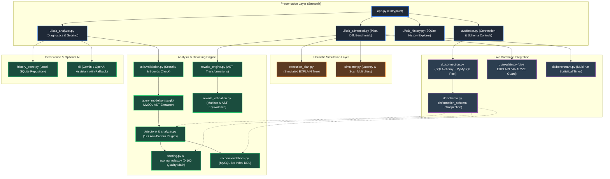
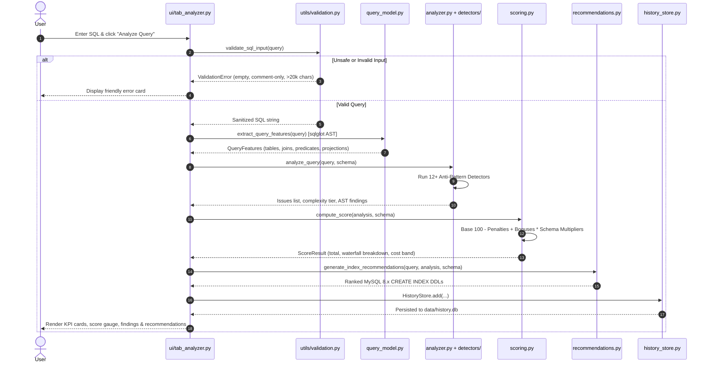
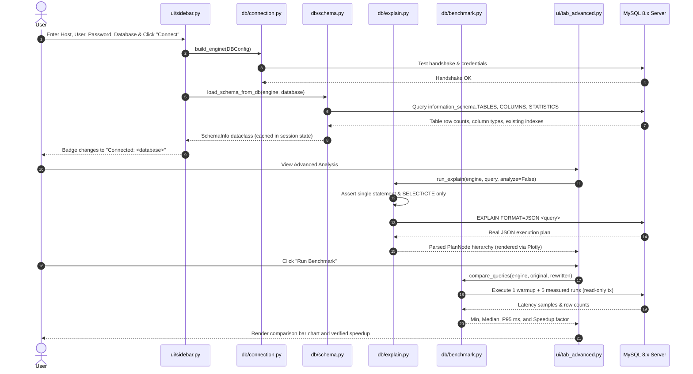

# System Architecture & Technical Design

## 🏛️ Executive Architecture Overview

**MySQL Query Optimizer & Index Recommender** is architected as a layered, modular analysis engine with dual-mode execution:
1. **Offline Mode (Static Heuristics & Simulation):** Operates purely on SQL strings without requiring a live database. Analyzes syntax trees, checks rules, suggests indexes, rewrites queries, and simulates execution plans using MySQL 8.x optimizer heuristics.
2. **Live Database Mode (Introspective Verification):** Connects to a MySQL 8.x database over connection pools, extracts metadata from `information_schema`, executes authentic `EXPLAIN FORMAT=JSON`, validates rewrites on live data, and benchmarks millisecond latencies.

---

## 🔄 Sequence Diagrams

### 1. Query Analysis Pipeline Flow (Offline Heuristic Mode)

This sequence describes what occurs when a user inputs a query and clicks **⚡ Analyze Query**:

---

### 2. Live Database Connection & Benchmarking Flow

This sequence traces connecting to a live MySQL instance, loading metadata, and executing real execution plans and timing benchmarks:

---

## 📦 Module Directory & Single-Responsibility Catalog

| Module / Package | Responsibility & Implementation Reality |
|---|---|
| [`app.py`](../app.py) | Application entrypoint (<90 LOC). Configures page metadata, injects design styles, renders the header, initializes session state, renders sidebar controls, and manages main tab routing with a global exception error boundary. |
| [`config.py`](../config.py) | Centralized application configuration driven by `pydantic-settings`. Manages DB settings, LLM providers, benchmark tolerances, and logging levels with strict precedence (`st.secrets` > environment > `.env` > defaults). |
| [`logging_config.py`](../logging_config.py) | Structured logging subsystem featuring rotating file logging (`logs/app.log`), console streams, and a regex-based `SecretMaskingFilter` to prevent passwords or API tokens from leaking into logs. |
| [`errors.py`](../errors.py) | Custom exception hierarchy (`QueryOptimizerError`, `QueryParseError`, `UnsafeQueryError`, `DBConnectionError`, `LLMError`) eliminating unhandled generic exceptions and bare `except:` blocks. |
| [`history_store.py`](../history_store.py) | Local SQLite persistence layer (`data/history.db`). Manages query history, pagination, search by substring, score filtering, and structured JSON report storage surviving server restarts. |
| [`query_model.py`](../query_model.py) | AST feature extractor using `sqlglot` with the MySQL dialect. Extracts statement type, table references, column projections, join conditions, WHERE predicates, subquery structures, and aggregates into a clean `QueryFeatures` dataclass. |
| [`analyzer.py`](../analyzer.py) | Core anti-pattern coordinator. Dispatches query features to registered detectors, evaluates query complexity, and falls back to regex tokenization if AST parsing encounters unrecoverable syntax errors. |
| [`detectors/`](../detectors/) | Plugin directory of discrete anti-pattern detectors (e.g. `sargable_functions.py`, `leading_wildcard.py`, `large_offset.py`, `missing_join_condition.py`, `insert_patterns.py`, `union_all.py`). Each detector implements a standardized interface. |
| [`scoring.py`](../scoring.py) | Pure scoring calculation engine. Evaluates baseline rules, applies table-size multipliers (`1.0x` to `2.0x`) when schema row counts are known, and clamps output strictly within `0` and `100`. |
| [`scoring_rules.py`](../scoring_rules.py) | Declarative repository of scoring rule definitions, point deltas, categories, severity badges, and user-facing explanations. Enables rule adjustments without touching scoring logic. |
| [`optimizer.py`](../optimizer.py) | Generates rule-based optimization guidance, static before/after SQL snippets, and deterministic rule-based insights (`generate_rule_insight`). Updates historical aliases transparently. |
| [`recommendations.py`](../recommendations.py) | Intelligent MySQL 8.x index advisor. Generates single-column, composite (equality first, then range, then sort), covering, and InnoDB FULLTEXT index DDL with safe naming conventions and duplicate index detection. |
| [`rewrite_engine.py`](../rewrite_engine.py) | AST-based query transformation engine. Rewrites `IN` subqueries to `EXISTS`, expands `SELECT *` using schema column metadata, transforms non-sargable date functions into sargable ranges, and injects row-capping `LIMIT` clauses. |
| [`rewrite_validation.py`](../rewrite_validation.py) | Validates semantic equivalence between original and rewritten SQL. Performs static AST checks (table parity, predicate preservation) and sample data multiset comparisons when connected to a live database. |
| [`execution_plan.py`](../execution_plan.py) | Execution plan node model (`PlanNode`) and synthetic MySQL 8.x heuristic plan generator. Simulates plan trees (`ALL`, `ref`, `range`, `filesort`, `temporary`) with documented cost weights. |
| [`simulator.py`](../simulator.py) | Arithmetic index impact modeling. Calculates estimated scan reductions, latency speedups, and score improvements based on InnoDB B-tree seek approximations. |
| [`db/connection.py`](../db/connection.py) | Production-grade MySQL 8.x connection management with SQLAlchemy and PyMySQL. Features pre-ping connection testing, configurable connection and read timeouts, and credential masking. |
| [`db/schema.py`](../db/schema.py) | Introspects live MySQL `information_schema` to extract table metadata, row estimates, column datatypes, and existing index structures into `SchemaInfo`. |
| [`db/explain.py`](../db/explain.py) | Executes live `EXPLAIN FORMAT=JSON` and `EXPLAIN ANALYZE` against MySQL 8.x. Enforces single-statement SELECT-only validation guards and translates JSON trees into unified `PlanNode` structures. |
| [`db/benchmark.py`](../db/benchmark.py) | Multi-run statistical execution timer. Executes warmup cycles followed by measured iterations within read-only transactions to report minimum, median, and P95 millisecond metrics. |
| [`db/schema_parser.py`](../db/schema_parser.py) | Offline DDL parser. Converts raw `CREATE TABLE` and `CREATE INDEX` SQL text or `.sql` files into unified `SchemaInfo` objects for users without a live database. |
| [`ai/`](../ai/) | Optional LLM insight provider supporting Gemini and OpenAI. Uses strict JSON schemas, timeout guards, and sends schema metadata and AST findings without ever transmitting table row data. |
| [`ui/`](../ui/) | Modular Streamlit presentation layer: `sidebar.py`, `tab_analyzer.py`, `tab_history.py`, `tab_dataset.py`, `tab_practices.py`, `tab_advanced.py`, `charts.py`, `components.py`, and `state.py`. |
| [`utils/`](../utils/) | Common helper utilities: `diff.py` (side-by-side SQL diffing), `validation.py` (SQL injection and input bounds validation), and `helpers.py` (formatters and report builders). |

---

## 🔍 Core Architectural & Engineering Decisions

### 1. Why `sqlglot` AST Parsing Over Pure Regex?
Regex-based SQL analysis is notoriously fragile: it fails on comments containing keywords, string literals (e.g. `WHERE status = 'SELECT *'`), complex nested subqueries, and table aliasing. Migrating to `sqlglot` with the MySQL dialect provides:
- **Resilience:** Comments and quoted strings are parsed into tokens rather than mistaken for clauses.
- **Structural Traversal:** Expressions can be navigated programmatically (inspecting parents, scopes, and predicate expressions).
- **Graceful Fallback:** If non-standard or malformed SQL triggers a syntax parse error, the engine automatically falls back to regex detection with a user-facing notice rather than crashing.

### 2. Why SQLite for Persistent Query History?
- **Zero Configuration:** Uses Python's standard library `sqlite3` without adding external daemon dependencies.
- **Portability:** Persists locally across browser refreshes and application restarts in `data/history.db`.
- **Query Performance:** Indexed timestamps and score columns enable sub-millisecond search and pagination across thousands of historical runs.

### 3. Why Strict SELECT-Only Guards for Live Database Operations?
Allowing arbitrary SQL execution against user databases presents severe security and data-loss risks. To guarantee safety:
- Only single-statement queries starting with `SELECT`, `WITH`, or `EXPLAIN` are accepted by the database execution engine.
- Multi-statement semicolons, `DROP`, `DELETE`, `UPDATE`, `INSERT`, `ALTER`, and `TRUNCATE` are strictly rejected before reaching the database socket.
- Benchmark executions are wrapped in read-only transactions with timeouts to prevent locking or performance degradation.

### 4. Deterministic Rule Engine with Optional LLM Assistant
Rather than making the entire tool dependent on external LLM APIs (which introduce latency, rate limits, non-determinism, and cost), the architecture establishes:
- A rock-solid, deterministic rule engine (12+ AST detectors + 16 scoring rules) that runs in sub-10ms offline.
- An optional, opt-in LLM assistant (`ai/` package) that provides supplementary natural language explanations while enforcing strict schema and plan-only context with zero table row data sharing.
